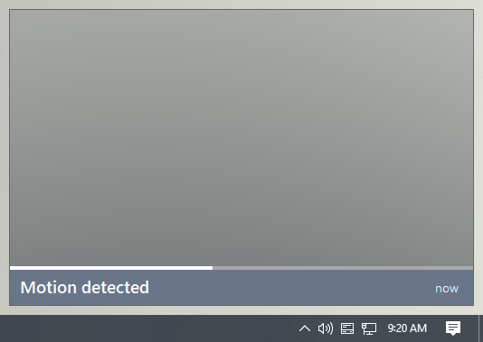

# IoT Notifications

Very simple application to receive and display notifications for security camera / homelab / IoT applications.

# Why

This project was born from the desire of a simple notification app that was lightweight and fully customizable (and I wanted the practice of building it myself).

Although I am doing my best to develop this with some reliability and security in mind, do not expect anything here _(at least at this stage)_ to be secure or bug free in any way.

# Current and planned features

## Current features

- Always-on-top image popup on secondary monitor
- Ingestion of images through ASP.NET Minimal API application _(POST https://*:9000/camera-event)_
- Query param authentication token
- Incoming images sequenced in a queue _(allows for low framerate videos such as from an IP camera)_

## Planned features

- More notification types _(currently only images are supported without message customization)_
- More integration protocols _(e.g. MQTT, raw UDP / TCP)_
- Per-integration configuration
- Relevant authentication methods _(e.g. basic / bearing for HTTP(S))_
- Notification personalization _(e.g. positioning, visibility / animation timings, sounds, etc.)_
- Toast integration
- Interactable timeline for image sequences
